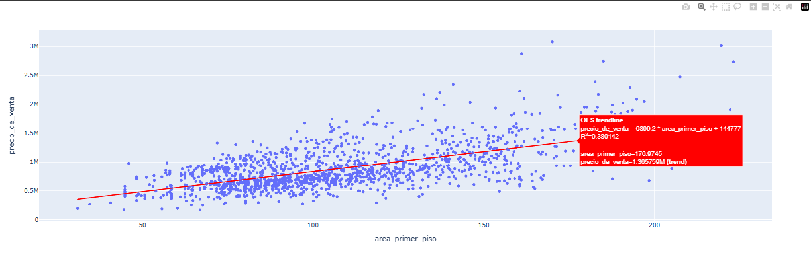
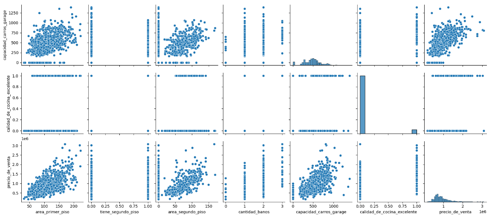
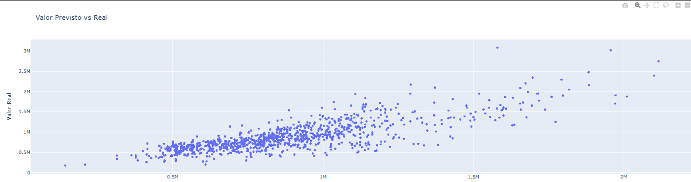

# 🏠 Proyecto: Precificación de Inmuebles

## 📌 Descripción del proyecto
Este proyecto tiene como objetivo **analizar las características de inmuebles** y desarrollar modelos de **regresión lineal** para **predecir el precio de venta** de las propiedades.  
Se utilizan datos de **1,438 inmuebles** que incluyen atributos físicos y de calidad de la vivienda.

---

## 📊 Datos analizados
**Columnas y descripción:**

| Columna | Descripción | Tipo de dato |
|---------|------------|--------------|
| `Id` | Identificador único del inmueble | int |
| `area_primer_piso` | Área en m² del primer piso | float |
| `tiene_segundo_piso` | Indica si el inmueble tiene un segundo piso (1 = sí, 0 = no) | int |
| `area_segundo_piso` | Área en m² del segundo piso | float |
| `cantidad_banos` | Número de baños | int |
| `capacidad_carros_garage` | Capacidad de vehículos en garage | int |
| `calidad_de_cocina_excelente` | Indica si la cocina es de calidad excelente (1 = sí, 0 = no) | int |
| `precio_de_venta` | Precio de venta del inmueble | float |

**Tipos de datos:**
- Númericos continuos: `area_primer_piso`, `area_segundo_piso`, `precio_de_venta`.  
- Númericos discretos/binarios: `tiene_segundo_piso`, `cantidad_banos`, `capacidad_carros_garage`, `calidad_de_cocina_excelente`.  

---

## 🛠 Tecnologías y librerías usadas
- **Lenguaje:** Python 🐍  
- **Entorno de ejecución:** Google Colab ☁️  
- **Librerías:**  
  - `pandas` 📊 para manipulación de datos  
  - `numpy` 🔢 para operaciones numéricas  
  - `matplotlib` & `seaborn` 📈 para visualización estática  
  - `plotly.express` 🌐 para gráficos interactivos  
  - `statsmodels` 📉 para regresión lineal  
  - `sklearn.metrics` 🧮 para evaluación de modelos  

---

## 📈 Visualizaciones y gráficos
### 1️⃣ Scatter plot: Área primer piso vs Precio de venta
Visualiza la relación lineal entre `area_primer_piso` y `precio_de_venta`.  

### 2️⃣ Pairplot de todas las variables
Permite observar relaciones y correlaciones entre múltiples variables.

### 3️⃣ Valores previstos vs reales
Compara el **precio predicho por el modelo** frente al **precio real** de los inmuebles.  

---

## 🧮 Modelos de regresión lineal
Se construyeron varios modelos OLS:

| Modelo | Variables incluidas | R² entrenamiento |
|--------|-------------------|----------------|
| Modelo 0 | Solo `area_primer_piso` | 0.38 |
| Modelo 1 (saturado) | Todas las variables | 0.74 |
| Modelo 2 | Sin `area_segundo_piso` | 0.71 |
| Modelo 3 | Sin `area_segundo_piso` ni `capacidad_carros_garage` | 0.65 |

**Validación del modelo 3:**  
- R² en base de prueba: 0.65  
- R² en base de entrenamiento: 0.65  

💡 Se eligió el **modelo 3** como balance entre **simplicidad y desempeño**, eliminando variables con menor aporte predictivo y evitando sobreajuste.

---

## ⚠️ Problemas encontrados y soluciones
- **Multicolinealidad:** Variables correlacionadas (`area_segundo_piso` y `tiene_segundo_piso`).  
  ✅ Solución: probar modelos excluyendo variables para evaluar impacto en R².  
- **Distribución de residuos no normal:** Detectada en test de Jarque-Bera.  
  ✅ Solución: aceptada debido a la naturaleza sesgada de precios.  
- **Variables con poca influencia:** Eliminadas para mejorar interpretabilidad sin afectar desempeño.  

---

## 📑 Resumen del análisis
- Variables con mayor impacto en el precio:  
  - `calidad_de_cocina_excelente`  
  - `area_primer_piso`  
  - `cantidad_banos`  
- Tener un segundo piso aumenta significativamente el precio, pero su área no siempre aporta tanto.  
- Capacidad del garage tiene impacto menor, positivo.  
- El modelo final predice precios de manera confiable con **R² ~0.65**, equilibrando complejidad y precisión.

---

## 🎯 Conclusión
El análisis permitió identificar **factores determinantes en la precificación de inmuebles**.  
Se construyó un modelo de regresión lineal interpretativo y confiable que puede servir como base para **estrategias de valoración o inversión inmobiliaria**.

